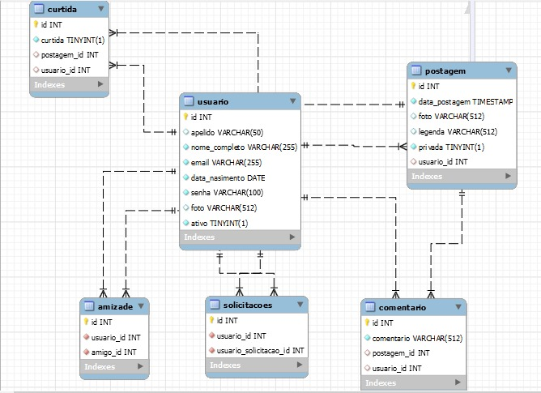

# Vamos iniciar.

## Descição do Projeto
Projeto consiste em fazer postagens de uma rede social destinada a marcar jogos amadores de futebol (rachas) e noticias esportivas, é possivel fazer amizade, enviar solicitacoes, e curtir publicacoes.
### 1 - Iniciar banco de dados.

Esquema relacional:
<p align="center">
  
</p>

#### 1.1 - Com o comando nós criamos o banco de dados (Postgresql).

```postgresql
CREATE DATABASE racha;
```
#### 1.2 - Com o comando abaixo nós nos certificamos que nossas tabelas serão criadas. A execução do script deve ser necessariamente nessa ordem.

```postgresql
DROP TABLE IF EXISTS usuario CASCADE;
DROP TABLE IF EXISTS amizade CASCADE;
DROP TABLE IF EXISTS solicitacoes CASCADE;
DROP TABLE IF EXISTS postagem CASCADE;
DROP TABLE IF EXISTS comentario CASCADE;
DROP TABLE IF EXISTS curtida CASCADE;


CREATE TABLE usuario (
                         id BIGINT GENERATED BY DEFAULT AS IDENTITY NOT NULL,
                         apelido VARCHAR(50),
                         nome_completo VARCHAR(255) NOT NULL,
                         email VARCHAR(255) NOT NULL,
                         data_nasimento DATE NOT NULL ,
                         senha VARCHAR(100) NOT NULL,
                         foto VARCHAR(512),
                         ativo BOOLEAN NOT NULL
);
ALTER TABLE usuario ADD CONSTRAINT pk_usuario PRIMARY KEY (id);
ALTER TABLE usuario ADD CONSTRAINT uk_usuario_email UNIQUE (email);

CREATE TABLE amizade (
                         id BIGINT GENERATED BY DEFAULT AS IDENTITY NOT NULL,
                         usuario_id BIGINT NOT NULL,
                         amigo_id BIGINT NOT NULL

);
ALTER TABLE amizade ADD CONSTRAINT pk_amizade PRIMARY KEY (id);
ALTER TABLE amizade ADD CONSTRAINT uk_amizade UNIQUE (usuario_id, amigo_id);
ALTER TABLE amizade ADD CONSTRAINT fk_amizade_usuario FOREIGN KEY (usuario_id) REFERENCES usuario;
ALTER TABLE amizade ADD CONSTRAINT fk_amizade_amigo FOREIGN KEY (amigo_id) REFERENCES usuario;


CREATE TABLE solicitacoes (
                              id BIGINT GENERATED BY DEFAULT AS IDENTITY NOT NULL,
                              usuario_id BIGINT NOT NULL,
                              usuario_solicitacao_id BIGINT NOT NULL

);
ALTER TABLE solicitacoes ADD CONSTRAINT pk_solicitacoes PRIMARY KEY (id);
ALTER TABLE solicitacoes ADD CONSTRAINT uk_solicitacoes UNIQUE (usuario_id, usuario_solicitacao_id);
ALTER TABLE solicitacoes ADD CONSTRAINT fk_solicitacoes_usuario FOREIGN KEY (usuario_id) REFERENCES usuario;
ALTER TABLE solicitacoes ADD CONSTRAINT fk_solicitacoes_amigo FOREIGN KEY (usuario_solicitacao_id) REFERENCES usuario;


CREATE TABLE postagem (
                          id BIGINT GENERATED BY DEFAULT AS IDENTITY NOT NULL,
                          data_postagem TIMESTAMP NOT NULL ,
                          foto VARCHAR(512),
                          legenda VARCHAR(512),
                          privada BOOLEAN NOT NULL,
                          usuario_id BIGINT
);
ALTER TABLE postagem ADD CONSTRAINT pk_postagem PRIMARY KEY (id);
ALTER TABLE postagem ADD CONSTRAINT fk_postagem_usuario FOREIGN KEY (usuario_id) REFERENCES usuario;


CREATE TABLE comentario (
                            id BIGINT GENERATED BY DEFAULT AS IDENTITY NOT NULL,
                            comentario VARCHAR(512) NOT NULL,
                            postagem_id BIGINT,
                            usuario_id BIGINT

);
ALTER TABLE comentario ADD CONSTRAINT pk_comentario PRIMARY KEY (id);
ALTER TABLE comentario ADD CONSTRAINT fk_comentario_usuario FOREIGN KEY (usuario_id) REFERENCES usuario;
ALTER TABLE comentario ADD CONSTRAINT fk_comentario_postagem FOREIGN KEY (postagem_id) REFERENCES postagem;


CREATE TABLE curtida (
                         id BIGINT GENERATED BY DEFAULT AS IDENTITY NOT NULL,
                         postagem_id BIGINT,
                         usuario_id BIGINT

);
ALTER TABLE curtida ADD CONSTRAINT pk_curtida PRIMARY KEY (id);
ALTER TABLE curtida ADD CONSTRAINT uk_curtida_usuario_postagem UNIQUE (usuario_id, postagem_id);
ALTER TABLE curtida ADD CONSTRAINT fk_curtida_usuario FOREIGN KEY (usuario_id) REFERENCES usuario;
ALTER TABLE curtida ADD CONSTRAINT fk_curtida_postagem FOREIGN KEY (postagem_id) REFERENCES postagem;
```
#### 1.3 - Com os comandos abaixo nós inserimos informações no nosso banco de dados. A execução do script deve ser necessariamente nessa ordem.
```postgresql
--usuarios--
INSERT INTO usuario (
    email, nome_completo, senha, data_nasimento, ativo, foto, apelido)
VALUES ('admin@cwi.com.br', 'Arrascaeta', '$2a$10$VrIbJURwINOR5HOrWFFTNOwSILsioRJSuOGAg8Luvr9qZDSOl5JXG', '2000-01-01', true, 'https://storage.googleapis.com/dpw/app/uploads/2019/04/lazy-loading-nativo-imagens-iframes_.jpg', 'admin');

INSERT INTO usuario (
    email, nome_completo, senha, data_nasimento, ativo, foto, apelido)
VALUES ('usuario@cwi.com.br', 'Bruno Henrique', '$2a$10$VrIbJURwINOR5HOrWFFTNOwSILsioRJSuOGAg8Luvr9qZDSOl5JXG','2000-01-01', true, 'https://storage.googleapis.com/dpw/app/uploads/2019/04/lazy-loading-nativo-imagens-iframes_.jpg', 'user');

INSERT INTO usuario (
    email, nome_completo, senha, data_nasimento, ativo, foto, apelido)
VALUES ('estagiario@cwi.com.br', 'Gabigol', '$2a$10$VrIbJURwINOR5HOrWFFTNOwSILsioRJSuOGAg8Luvr9qZDSOl5JXG','2000-01-01', true, 'https://storage.googleapis.com/dpw/app/uploads/2019/04/lazy-loading-nativo-imagens-iframes_.jpg', 'estag');

--solicitacoes --
INSERT INTO solicitacoes(usuario_solicitacao_id, usuario_id) VALUES (3, 1);
INSERT INTO solicitacoes(usuario_solicitacao_id, usuario_id) VALUES (3, 2);

--amizades--
INSERT INTO amizade(amigo_id, usuario_id) VALUES (1, 2);
INSERT INTO amizade(amigo_id, usuario_id) VALUES (2, 1);

--postagens--
INSERT INTO postagem(
    data_postagem, foto, legenda, privada, usuario_id)
VALUES (CURRENT_TIMESTAMP, 'https://storage.googleapis.com/dpw/app/uploads/2019/04/lazy-loading-nativo-imagens-iframes_.jpg', 'Ao vivo no Rio de janeiro', FALSE, 1);

INSERT INTO postagem(
    data_postagem, foto, legenda, privada, usuario_id)
VALUES (CURRENT_TIMESTAMP, 'https://storage.googleapis.com/dpw/app/uploads/2019/04/lazy-loading-nativo-imagens-iframes_.jpg', 'Fala nação rubro negra', FALSE, 1);

INSERT INTO postagem(
    data_postagem, foto, legenda, privada, usuario_id)
VALUES (CURRENT_TIMESTAMP, 'https://storage.googleapis.com/dpw/app/uploads/2019/04/lazy-loading-nativo-imagens-iframes_.jpg', 'Diretamente do maracanã', FALSE, 2);

--curtida--
INSERT INTO curtida(postagem_id, usuario_id) VALUES (1, 2);
INSERT INTO curtida(postagem_id, usuario_id) VALUES (2, 2);
INSERT INTO curtida(postagem_id, usuario_id) VALUES (3, 1);

--comentarios--
INSERT INTO comentario(postagem_id, usuario_id, comentario) VALUES (1, 1, 'Vamos flamengo. p1-u1');
INSERT INTO comentario(postagem_id, usuario_id, comentario) VALUES (1, 2, 'Hoje eh dia de jogo. p1-u2');
INSERT INTO comentario(postagem_id, usuario_id, comentario) VALUES (1, 3, 'Raça até o fim timee. p1-u3');
INSERT INTO comentario(postagem_id, usuario_id, comentario) VALUES (3, 1, 'comentando a publi 3 usuario 1');
```


### 2 - Importando o projeto.
#### 2.1 - Alocando na sua máquina.
git clone via HTTPS:
```shell
git clone https://git.cwi.com.br/crescer/2023-01/alunos/giovane.tiburcio.git
```
Localização: java/trabalhos/tcc/racha.

##### 2.2 - Importando a API.
No seu IntelliJ vá em file/open, em seguida procure pelo destino onde alocou o projeto(2.1) importe, e aguarde os downloads das dependências Mavem.

Após a conclusão do download, vá no arquivo application.yml e altere o username e o password da conexão com o banco de dados, para os vigentes da sua maquina, e em seguida a aplicação já pode ser iniciada.
##### 2.3 - Importando o front.
No seu Visual Studio Code, de modo similar com 2.1.1, importe o projeto, em seguida efetue os comandos no seu terminal:
```shell
npm install
npm start
```
Após isso a aplicação estará funcionando.

### 3 - Importando as collections no postman e as ultilizando.
##### 3.1 - Importando.
Na pasta raiz, melevai, se encontra o arquivo 'racha.postman_collection.json', importe e assim você já as poderá utilizar.
##### 3.2 - Utilizando.
Nas requests marcadas com os verbos put e post verifique sempre o body e esteja atento as menssgens da API, e o status das respostas.
Esteja atento tambem aos parametros da url, eles influenciam nas requisições.

No front, não havia mais tempo, entao setei uma postagem fixa, para vermos a altercao de comentarios, basta comentar no postman, e visualizar o resultado no front.

### 4 - Tecnologias utilizadas:
```shell
Java 11
InteliJ IDEA
Postgres SQL
PgAdmin
React
Visual Studio Code
JavaScript
```